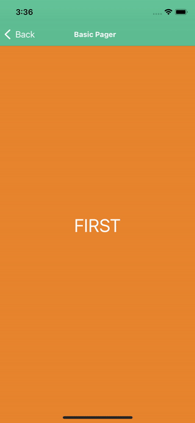

# NativeScript Pager

[](https://www.npmjs.com/package/@nativescript-community/ui-pager)
[](https://www.npmjs.com/package/@nativescript-community/ui-pager)
[](https://www.npmjs.com/package/@nativescript-community/ui-pager)

A NativeScript Pager / Carousel component that allows the user to swipe left and right through pages of data. 

|  |  |
| --- | ----------- |
| iOS Demo | Android Demo |

---
## Table of Contents
1. [Installation](#installation)
2. [API](#api)
3. [Usage in Angular](#usage-in-angular)
4. [Usage in React](#usage-in-react)
5. [Usage in Svelte](#usage-in-svelte)
6. [Usage in Vue](#usage-in-vue)
7. [Demos and Development](#demos-and-development)

## Installation
Run the following command from the root of your project:

`ns plugin add @nativescript-community/ui-pager`

## API

### Properties

| Property | Type |
| - | - |
| items | `array` or `ItemsSource` 
| selectedIndex | `number` |
| canGoRight | `boolean` |
| canGoLeft | `boolean` |
| spacing | `PercentLengthType` |
| peaking | `PercentLengthType` |
| perPage | `number` |
| indicator | `string`  ('disable', 'none', 'worm', 'fill', 'swap', 'thin_worm', 'flat')|
| circularMode | `boolean` |
| autoPlayDelay | `number` |
| autoPlay | `boolean` |
| orientation | `string` ('horizontal' or 'vertical') |
| autoPlay | `boolean` |
| disableSwipe | `boolean` |
| showIndicator | `boolean` |
| indicatorColor | `Color` or `string` |
| indicatorSelectedColor | `Color` or `string` |


```
Pager for NativeScript supports the core ObservableArray module part of the core NativeScript modules collection. Using an ObservableArray instance as a source for Pager will ensure that changes in the source collection will be automatically taken care of by the control.
````


## Usage in Angular

Import the module into your project.

```typescript
import { PagerModule } from "@nativescript-community/ui-pager/angular";

@NgModule({
    imports: [
        PagerModule,
    ],
})
```

### Examples:

- [Static Pager](demo-snippets/ng/static-pager)
  - A simple pager example using static content.
- [Basic Pager](demo-snippets/ng/basic-pager)
  - A simple pager example using dynamic content.

## Usage in React

Import the module into your project.

```typescript
import { Pager } from '@nativescript-community/ui-pager/react';
```

### Examples:

- [Basic Pager](demo-snippets/react/BasicPager.tsx)
  - A simple pager example using dynamic content.
## Usage in Svelte

Import the module into your project.

```typescript
import { registerNativeViewElement } from 'svelte-native/dom';

import PagerElement from '@nativescript-community/ui-pager/svelte';
import { PagerItem } from '@nativescript-community/ui-pager';

PagerElement.register();
registerNativeViewElement('pageritem', () => PagerItem);
```

### Examples:

- [Static Pager](demo-snippets/svelte/StaticPager.svelte)
  - A simple pager example using static content.
- [Basic Pager](demo-snippets/svelte/BasicPager.svelte)
  - A simple pager example using dynamic content.

## Usage in Vue

Import the module into your project.

```typescript
import Vue from 'nativescript-vue';
import Pager from '@nativescript-community/ui-pager/vue';

Vue.use(Pager);
```

### Examples:

- [Static Pager](demo-snippets/vue/StaticPager.vue)
  - A simple pager example using static content.
- [Basic Pager](demo-snippets/vue/BasicPager.vue)
  - A simple pager example using dynamic content.

## Demos and Development

To run the demos, you must clone this repo **recursively**.

```
git clone https://github.com/nativescript-community/ui-pager.git --recursive
```

### Install Dependencies:
```bash
npm i # or 'yarn install' or 'pnpm install'
```

### Interactive Menu:
To start the interactive menu, run `npm start` (or `yarn start` or `pnpm start`). This will list all of the commonly used scripts.

### Building Plugin:
```bash
npm run build

# or for Angular
npm run build.angular
```

### Running Demos:
```bash
npm run demo.[ng|react|svelte|vue].[ios|android]

# Example:
npm run demo.svelte.ios
```
